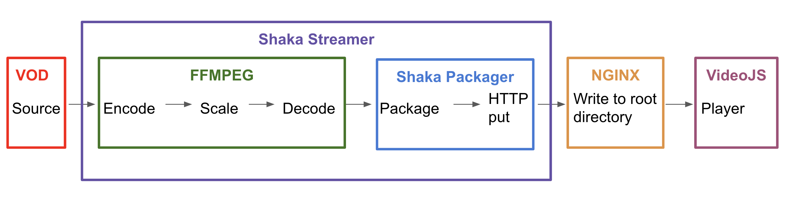
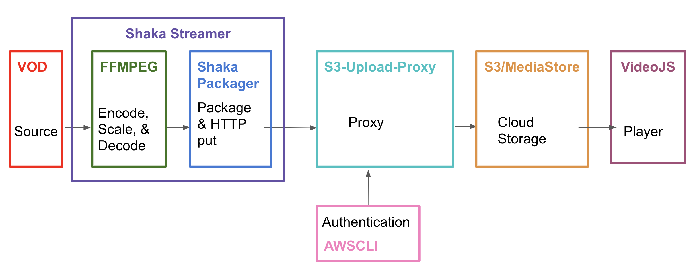
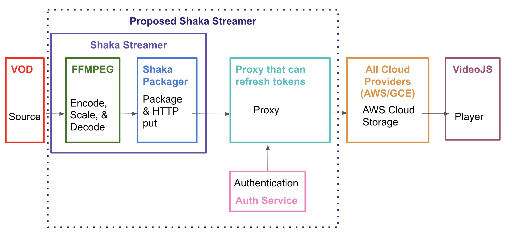

# shaka-streamer-demo


\
This project is for StreamShark. All rights reserved.

\
⚠️ For this use demo, BigBuckBunny will be streamed. Sorry in advance for the trauma.

------

## Breakdown on shaka-streamer
Shaka Streamer encapsulates FFMPEG and Shaka Packager. Yaml configuration files are used to specify the input parameters of the video stream. Equivalently, python dictionaries can be used with the streamer python module. More information on Shaka Streamer can be found [here](https://github.com/google/shaka-streamer).

Shaka Streamer currently supports writing out to local files and directly to S3. The forks of Shaka Streamer and Shaka Packager used in this demo include the added feature of HTTP output.

## Architecture

### Nginx

To stream with Nginx, HTTP put simply hits the port that Nginx is running on. 



### AWS

AWS requires the addition of a proxy to assist in authentication. Alternatively, a shim can also be used to provide ultra low latency; however, this is not needed when streaming video on demand. Therefore, a proxy will suffice. Proxies add the benefit of refreshed authentication tokens. 



It is a known issue that Shaka Streamer's native authentication tokens expire after about an hour when using Shaka Streamer to stream directly to S3. It is proposed that platform independent authentication is added to Shaka Streamer. This feature must refresh tokens. 



### Useful Resources
Joey Parrish, a software engineer on the Shaka Player team at Google, is highly active on Github. He is willing to help out and advise this project 😊. 

------

## Installation

NOTE: This tutorial is designed for Ubuntu 20.04. 

To set up your environment, clone this repo, cd into the main directory, and run the build script. This script will install all of the needed dependencies. 

```console
foo@bar:~$ git clone https://github.com/CaitlinOCallaghan/shaka-streamer-demo.git 
foo@bar:~$ cd shaka-streamer-demo 
foo@bar:~/shaka-streamer-demo$ ./build.sh
```

After the installation, configure your AWS credentials with awscli. This step is critical for accessing your S3 buckets and MediaStore containers. Follow the command line prompts to enter your Access Key ID and Secret Access Key. For more information and instructions on where to find your AWS keys, you can visit AWS documentation [here](https://docs.aws.amazon.com/cli/latest/userguide/cli-configure-quickstart.html). 

```console
foo@bar:~$ aws configure
```

To ensure that your credentials have been added, checkout your aws directory and peek into the credentials file. 

```console
foo@bar:~$ cd ~/.aws
foo@bar:~/.aws$ cat credentials
[default]
aws_access_key_id={YOUR KEY ID}
aws_secret_access_key={YOUR KEY}
foo@bar:~/.aws$

```

🎉 Now that your environment is set up, you are all set to go on the demos!

------

## Local Playout
Shaka-Streamer allows users to store generated video segments and manifests locally. The video can be viewed on a local server through an html player. 

Begin by launching the local http server with the launch script.

```console
foo@bar:~/shaka-streamer-demo$ ./launch_local_server.sh
```

From a separate terminal, run the local live script to start shaka streamer and dump the output files in a directory of your choice. This directory is specified in the script.  

```console
foo@bar:~/shaka-streamer-demo$ ./local_live_streamer.sh # using streamer
```

From your web browser, checkout the live stream at: http://0.0.0.0:3000/local_index.html. If the machine running the server is remote, use the machine's IP instead of the local address of 0.0.0.0.

## Nginx
First, ensure that nginx is properly set for http requests. Navigate to  the "/etc/nginx/sites-enabled" directory and alter the file "default". 
```console
foo@bar:/etc/nginx/sites-enabled$ ls
default
```

Edit the default file so that the "location" block includes the following. 

```console
	location / {
		# First attempt to serve request as file, then
		# as directory, then fall back to displaying a 404.
		try_files $uri $uri/ =404;
		
	    client_body_temp_path /srv/upload;
        dav_methods PUT DELETE MKCOL COPY MOVE;
		create_full_put_path  on;
		dav_access  group:rw  all:r;
        limit_except GET {
            allow all;
        }
	}
```

Before streaming, make sure that nginx turned on and take note of the port that it is running on. Then, stream the content by running the following launch script. Set the port at the top of the script to that of Nginx. 

```console
foo@bar:~/shaka-streamer-demo$ ./ffmpeg_hls_and_dash.sh # using ffmpeg and packager
```

To stream with Shaka Streamer, run: 
```console
foo@bar:~/shaka-streamer-demo$ ./nginx_live_streamer.sh # using streamer
```

Also make sure to chown -R www-data /srv/upload _and_ also /var/www/html

## AWS 
Before streaming to AWS, HTTP authorization must be granted in the bucket and container policies. Make sure that the "Resource" is set to your unique bucket or container arn which will include your region. Under "Principal", set the "AWS" value to include your account number.  

For S3 Buckets, ensure that the policy is: 

```
{
    "Version": "2012-10-17",
    "Statement": [
        {
            "Effect": "Allow",
            "Principal": {
                "AWS": "arn:aws:iam::44444444444:root"
            },
            "Action": [
                "s3:PutObject",
                "s3:PutObjectAcl"
            ],
            "Resource": "arn:aws:s3:::bucket-name/*"
        }
    ]
}
```

For MediaStore Containers, set the container policy to: 

```
{
  "Version": "2012-10-17",
  "Statement": [
    {
      "Sid": "MediaStoreFullAccess",
      "Effect": "Allow",
      "Principal": {
        "AWS": "arn:aws:iam::44444444444:root"
      },
      "Action": "mediastore:*",
      "Resource": "arn:aws:mediastore:us-west-2:555555555555:container/container-name/*",
      "Condition": {
        "Bool": {
          "aws:SecureTransport": "true"
        }
      }
    },
    {
      "Sid": "PublicReadOverHttps",
      "Effect": "Allow",
      "Principal": "*",
      "Action": [
        "mediastore:GetObject",
        "mediastore:DescribeObject"
      ],
      "Resource": "arn:aws:mediastore:us-west-2:555555555555:container/container-name/*",
      "Condition": {
        "Bool": {
          "aws:SecureTransport": "true"
        }
      }
    }
  ]
}
```

With AWS set up, it's time to stream the video! 

Start by launching the proxy on S3 or MediaStore: 

```console
foo@bar:~/shaka-streamer-demo$ ./s3_launch_proxy.sh
foo@bar:~/shaka-streamer-demo$ ./mediastore_launch_proxy.sh
```

In a second terminal, launch the script running FFMPEG to encode the video and shaka-packager to package it. Set the port at the top of the script to the port of the proxy. 

```console
foo@bar:~/shaka-streamer-demo$ ./ffmpeg_hls_and_dash.sh # using ffmpeg and packager
```

To stream to AWS using Shaka Streamer, run the following script. Ensure that the http url includes the port that the proxy is running on. 
```console
foo@bar:~/shaka-streamer-demo$ ./aws_live_streamer.sh # using streamer
```

Through AWS, you can access links for the video manifests and play them out via QuickTime player or VLC. 

Alternatively, you can run the end-to-end script. This script runs FFMPEG, Shaka-Packager, and s3-upload-proxy, which puts the video segments and manifests in S3 or MediaStore. The script also uploads an HTML player to AWS for users to view the stream from. Edit the parameters at the top of the script to specify the cloud service you'd like to stream to and to enter your unique bucket and user IDs. 

```console
foo@bar:~/shaka-streamer-demo$ ./e2e_aws_stream.sh # using ffmpeg and packager
```

